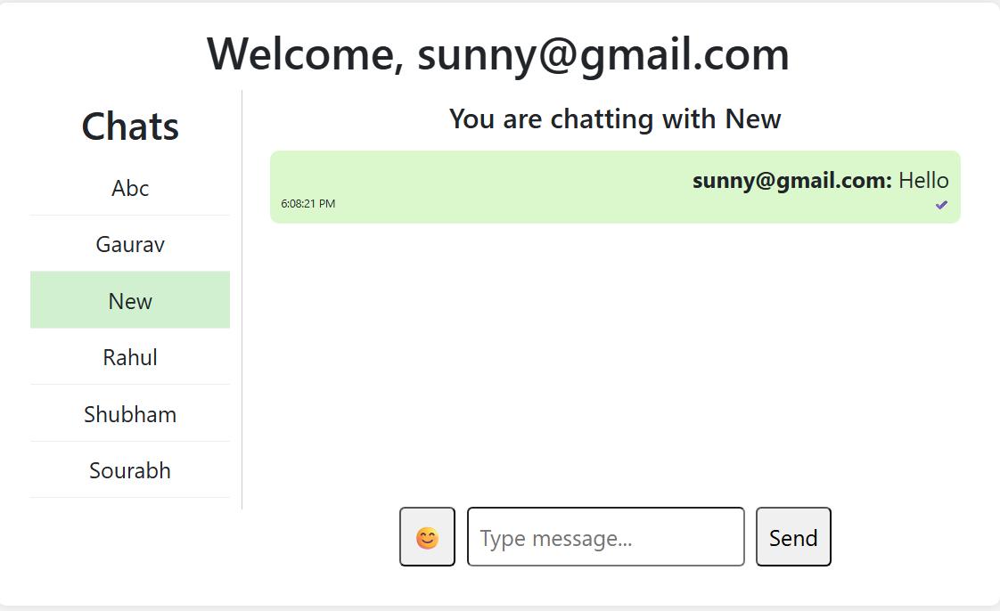

# ChatFlow — Real-Time Chat Application

---

A MERN Stack real-time chat application that allows users to register, login, and communicate instantly with other users using WebSockets.  
Built with a React frontend, Node.js/Express backend, MongoDB database, and Socket.IO for real-time messaging.

---

## 🚀 Demo Link

[Live Demo](https://chat-flow-swart.vercel.app/)

---

## ⚡ Quick Start

```bash
git clone https://github.com/Sourabhpande532/CHAT_FLOW.git
cd CHAT_FLOW.git
npm install
npm run dev / npm start
```

---

## Technologies

- React Js
- Node Js
- Express Js
- MongoDB
- Socket.IO
- RESTful APIs
- JWT Authentication

---

## Features

**Authentication**

- User Register and Login functionality
- Secure password hashing using bcrypt
- JWT-based authentication

---

**Real-Time Messaging**

- Send and receive messages instantly using **Socket.IO**
- Messages stored in MongoDB for persistence

---

**User List**

- View all registered users (excluding current user)
- Start chat with any available user

---

**Typing Indicator**

- Shows when another user is typing in real-time

---

**Read Receipts**

- Messages marked as **read/unread**
- Real-time update when messages are read

---

**Message History**

- Fetch previous conversations between users
- Sorted messages for proper chat flow

---

**Notifications**

- Real-time updates for new messages

---

## Reference



## API Reference

### POST /auth/register

Register a new user.
Sample Response:

```
{
  "success": true,
  "message": "Register successfully",
  "token": "jwt_token",
  "username": "user_name"
}
```

### POST /auth/login

Login an existing user.
Sample Response:

```
{
  "success": true,
  "message": "Login successful",
  "username": "user_name"
}

```

### GET /messages

Fetch chat messages between two users.

Query Params:

- sender
- receiver

```
[
 {
   "sender": "user1",
   "receiver": "user2",
   "message": "Hello!",
   "createdAt": "timestamp"
 }
]

```

### GET /users

Fetch all users except current user.

Query Params:

- currentUser

```
[
  {
    "_id": "user_id",
    "username": "user_name"
  }
]

```

---

## Environment Setup

**Backend (/server/.env)**

```
PORT=5000

MONGO_URI=mongodb+srv://<username>:<password>@cluster.mongodb.net/chatapp

JWT_SECRET=your_secret_key

CLIENT_URL=http://localhost:3000

```

**Frontend**

```
REACT_APP_BASE_URL=http://localhost:5000

```

---

## Contact

For bugs or feature requests, please reach out to [sourabhpande43@gmail.com](mailto:sourabhpande43@gmail.com)

---
